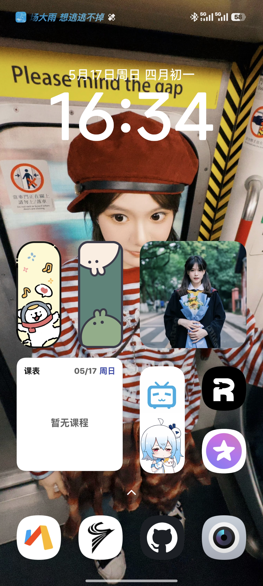
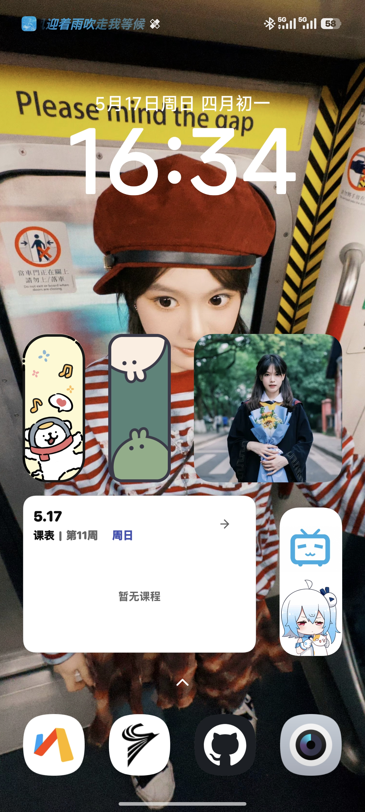
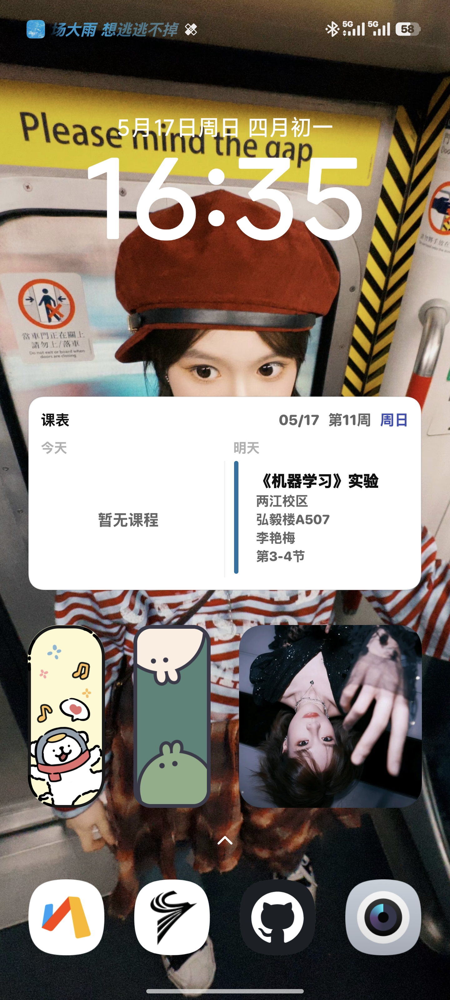

# CQUT Helper

**CQUT Helper** 是一款面向重庆理工大学同学的课表助手 App。项目基于 Flutter 开发，遵循 Material 3 设计规范，致力于提供美观、流畅、便捷的课表查看体验。

## 📑 目录

- [✨ 主要功能](#features)
- [📱 下载安装](#download)
- [📄 开源协议](#license)
- [🔒 隐私说明](#privacy)
- [⚠️ 开发说明](#development)
- [📚 参考资料](#references)
- [🎉 特别感谢](#thanks)
- [👀 访问统计](#VisitorCount)

## ✨ 主要功能

围绕课表查看、信息获取与资料浏览，提供简洁顺手的校园课程辅助体验。

<table>
  <tr>
    <td width="50%" valign="top">
      <strong>课程表</strong> 
      支持展示每周课程；添加桌面小组件后，还可在桌面直接查看课程信息。
    </td>
    <td width="50%" valign="top">
      <strong>个人中心</strong> 
      实现了“本科课表（测试）”中的 <a href="https://timetable-cfc.cqut.edu.cn/api/courseSchedule/getUserInfo">getUserInfo</a> 接口，可便捷查看个人信息。
    </td>
  </tr>
  <tr>
    <td width="50%" valign="top">
      <strong>个性化主题</strong> 
      支持 Material 3 动态取色（Dynamic Color），界面可随心而动。
    </td>
    <td width="50%" valign="top">
      <strong>自动获取</strong> 
      实现了“本科课表（测试）”中的 <a href="https://timetable-cfc.cqut.edu.cn/api/courseSchedule/listWeekEvents">listWeekEvents</a> 接口，可自动获取课表数据。
    </td>
  </tr>
  <tr>
    <td colspan="2" valign="top">
      <strong>开源浏览</strong> 
      内置简易 GitHub 仓库浏览器，可用于浏览 <a href="https://github.com/Royfor12">Royfor12</a> 的 <a href="https://github.com/Royfor12/CQUT-Course-Guide-Sharing-Scheme">CQUT-Course-Guide-Sharing-Scheme</a> 仓库并获取课程资料。
        
      本功能仅提供对 CQUT-Course-Guide-Sharing-Scheme 仓库的浏览和下载服务；所有内容版权归原作者所有，遵循 <a href="https://creativecommons.org/licenses/by-nc-sa/4.0/deed.zh">CC BY-NC-SA 4.0</a> 协议。本软件不对相关内容进行修改、存储或商业利用。
    </td>
  </tr>
</table>

> [!IMPORTANT]
> 应用小组件基于 Android 原生 Widget API。受各家定制系统影响，添加方式和实际展示样式可能存在差异；如果在添加过程中遇到问题，请自行搜索对应系统的相关教程。

<strong>小组件样式预览</strong>

<table align="center">
  <tr>
    <td align="center"></td>
    <td align="center"></td>
    <td align="center"></td>
  </tr>
  <tr>
    <td align="center">今日课程</td>
    <td align="center">日视图</td>
    <td align="center">近日课程</td>
  </tr>
</table>

## 📱 下载安装

请前往 [Releases 页面](https://github.com/lhgr/CQUT-Helper/releases) 下载最新版本的 APK 安装包。

> [!TIP]
> 若不确定应下载哪个版本，建议优先选择 **Arm64-v8a**。

| 构建版本 | 说明 |
| --- | --- |
| **Universal** | 通用版 |
| **Arm64-v8a** | 适用于 64 位手机|
| **Armeabi-v7a** | 适用于 32 位手机 |

## 📄 开源协议

本项目采用 Apache License 2.0 协议开源，详情请参阅 [LICENSE](LICENSE) 文件。

## 🔒 隐私说明

我们尊重并保护用户的个人隐私：

1. **核心数据本地化**

   用户账号、密码（加密后）以及课表详情等核心隐私数据，默认仅存储在本地设备中。

   仅在使用“调课通知”功能时，由于相关接口存在应用端无法独立完成的加密参数，才需要由服务端协助处理，并将账号与加密后的密码发送至服务端以获取调课信息。相关实现代码见 [jwxt_automation.py](FastAPI/jwxt_automation.py)。

> [!WARNING]
> 仅在使用“调课通知”功能时，才会将账号与加密后的密码发送至服务端进行处理。

> [!NOTE]
> 该服务端仅用于处理调课通知，不会存储任何个人隐私信息。

2. **权限使用**

   应用仅会在确有必要时申请所需权限，并明确说明用途。

3. **Firebase 说明**

   Firebase 相关集成已移除，当前版本不再接入 Firebase，也不会向 Firebase 上传或同步用户数据。

> [!NOTE]
> [Firebase 相关集成移除记录](https://github.com/lhgr/CQUT-Helper/commit/3d42a06f253b720c4c41dfa1b47aa0960a0cd48c)

> [!NOTE]
> 如你仍有隐私顾虑，可自行部署 [jwxt_automation.py](FastAPI/jwxt_automation.py) 到自己的服务器，并在课程表设置的“启用后台定时轮询”中配置你的域名。

## ⚠️ 开发说明

> [!NOTE]
> 本项目的绝大部分代码由 **GPT-5.3-Codex** 完成，主要用于学习与实验。代码质量和设计模式可能仍有不足，仅供参考。

如果你在使用中遇到问题，或有任何建议，欢迎通过 [Issues](https://github.com/lhgr/CQUT-Helper/issues) 或 [邮件](mailto:dawndrizzle@outlook.com) 与我联系。

## 📚 参考资料

- [cqut-net-login](https://github.com/CQUT-handsomeboy/cqut-net-login)
  - 其中的 [密码加密模块](https://github.com/CQUT-handsomeboy/cqut-net-login/blob/main/encrypt.py) 为本项目提供了参考
- [Wake Up 课程表](https://www.wakeup.fun/)
  - 参考了它的 [桌面小部件](https://www.wakeup.fun/doc/widget.html) 样式

## 🎉 特别感谢

- [CQUT-Course-Guide-Sharing-Scheme](https://github.com/Royfor12/CQUT-Course-Guide-Sharing-Scheme)

  感谢各位上传的资料，~~屡次救我狗命~~。

## 👀 访问统计

  

---

> [!CAUTION]
> 本项目为第三方非官方客户端，仅供学习交流使用；如涉及侵权问题，请通过[邮件](mailto:dawndrizzle@outlook.com)联系我们。
