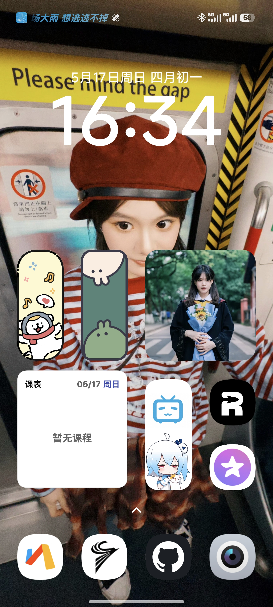
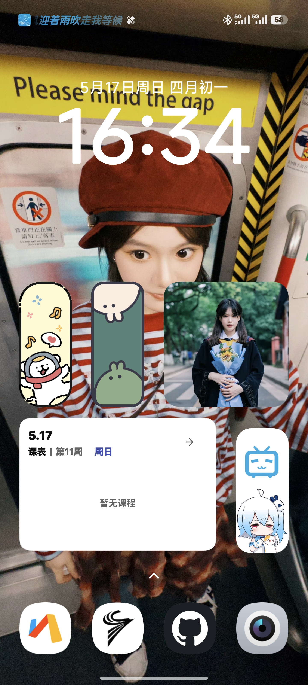
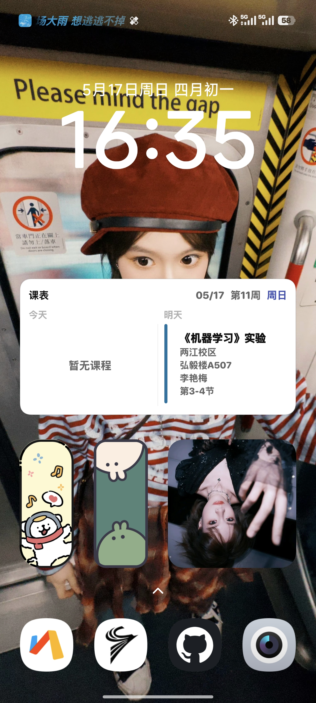

# CQUT Helper

**西唯兵学子的课表小帮手**

面向重庆理工大学同学的第三方课表助手，提供课表查看、桌面小组件、
课程提醒、调课通知、个性化设置和备份恢复。

[下载最新版本](https://github.com/lhgr/CQUT-Helper/releases) ·
[功能介绍](#-功能介绍) ·
[问题反馈](https://github.com/lhgr/CQUT-Helper/issues)

> \[!CAUTION]
> 本项目为第三方非官方客户端，仅供学习交流和日常课程辅助使用。重要课程安排请以学校官方信息为准。

## ✨ 功能介绍

| 功能         | 说明                                        |
| ---------- | ----------------------------------------- |
| **今日与周课表** | 查看当天课程和完整周课表，支持周次切换、周末显示与本地缓存             |
| **桌面小组件**  | 提供今日课程、日视图、近日课程、超小课程和垂直列表五种样式，支持课程结束和手动刷新 |
| **课前提醒**   | 根据课表安排课程通知，并可设置默认提前时间                     |
| **调课通知增强** | 可选查询当前学期调课信息，只刷新受影响周，并在消息中心记录新增、变更和撤销     |
| **课程个性化**  | 支持课程别名、备注、颜色、隐藏状态以及课程卡片布局调整               |
| **主题与背景**  | 支持亮色、深色、Material 3 动态取色、自选主题色和课表背景        |
| **备份与恢复**  | 导出或恢复课表布局、主题、提醒和课程个性化设置，不包含登录凭据           |
| **同步与诊断**  | 集中查看课表、小组件、通知权限和后台任务状态，并可导出诊断日志           |

### 课表体验

- 已同步课表会缓存在本机，临时断网时仍可查看已有课程。
- 今日页会区分“今天没课”和“当前不在教学周”。
- 可调整课表密度、单元格大小、网格线、卡片圆角、透明度和文字大小。
- 可隐藏教师、教室或校区前缀，并调整课程内容的对齐方式。
- 支持设置默认打开“今日”“课表”或“我的”页面。

### 桌面小组件

<table align="center">
  <tr>
    <td align="center"></td>
    <td align="center"></td>
    <td align="center"></td>
  </tr>
  <tr>
    <td align="center">今日课程</td>
    <td align="center">日视图</td>
    <td align="center">近日课程</td>
  </tr>
</table>

小组件会根据课程结束时间和北京时间日期变化更新内容，也可以点击右上角主动刷新。
无课、非教学周、尚未同步和缓存可能过期会显示不同提示，便于判断是否需要操作。

> \[!IMPORTANT]
> 小组件基于 Android 原生 Widget API。不同厂商的启动器、后台限制和省电策略可能影响添加方式、样式与刷新时间。

### 通知与消息中心

- 课前提醒会根据本机课表安排未来课程通知。
- “调课通知增强”为可选功能，只有主动开启并确认隐私提示后才会访问调课服务。
- 后台调课检查通常在北京时间 9:00 执行；上午失败时会在 12:00 补跑，0:00—7:00 暂停查询。
- 消息中心会保存本机调课与课表变更记录；清空记录不会修改学校课表。

详细说明见 [调课通知增强功能说明](FastAPI/README.md)。

## 📱 下载安装

前往 [Releases 页面](https://github.com/lhgr/CQUT-Helper/releases) 下载 APK：

| 安装包             | 适用设备                          |
| --------------- | ----------------------------- |
| **Arm64-v8a**   | 绝大多数现代 64 位 Android 手机，推荐优先选择 |
| **Armeabi-v7a** | 较旧的 32 位 Android 手机           |
| **x86\_64**     | 少数模拟器或 x86\_64 Android 设备     |
| **Universal**   | 不确定设备架构时使用，兼容范围更广但文件更大        |

更新应用时直接覆盖安装即可。为了保留登录状态、课表设置、消息记录和课程偏好，
不要先卸载旧版本。如果系统提示签名不一致，请确认新旧安装包来自同一发布渠道。

首次使用建议：

1. 登录账号并打开课表完成首次同步。
2. 根据需要设置周末显示、课程卡片和主题。
3. 如需课前提醒，前往“设置 → 通知与提醒”开启权限。
4. 添加桌面小组件后，若暂时显示“课表尚未同步”，请先回到应用同步一次课表。

## 🔒 数据与隐私

- 登录凭据、课表缓存和个性化设置默认保存在本机。
- Firebase 相关集成已移除，不再接入 Firebase，现已没有任何遥测服务存在，不会向 Firebase 上传或同步用户数据。
- 只有主动开启“调课通知增强”后，应用才会将学号、教务系统加密密码和当前学期发送到用户选择的调课服务。
- 配置自定义调课服务后，应用不会在失败时静默回退到官方服务。
- 备份文件不包含登录密码、可用于登录的凭据、诊断日志、课表缓存或自定义背景图片。

> \[!WARNING]
> 加密密码虽然不是明文密码，但能够用于访问教务系统，仍属于敏感凭据。请勿使用来源不明的自建调课服务。

[Firebase 集成移除记录](https://github.com/lhgr/CQUT-Helper/commit/3d42a06f253b720c4c41dfa1b47aa0960a0cd48c)

## ❓ 常见问题

### 小组件没有及时刷新

先打开应用确认登录状态并手动同步课表，再点击小组件刷新。如果仍无改善，请在
“设置 → 同步与诊断”检查后台状态，并允许应用自启动、后台运行和忽略电池优化。

### 小组件显示“课表可能已过期”

这表示本机缓存长时间没有得到成功同步确认。检查网络和登录状态后主动刷新即可。
如果最近已成功同步但当前不属于教学周，小组件会显示“当前不在教学周”。

### 收不到课前提醒或调课通知

检查通知权限、后台运行限制和电池优化设置。调课通知还需要主动开启“调课通知
增强”，并确保所选服务通过“检查服务可用性”。

### 备份会保存密码吗？

不会。备份只包含设置与课程个性化数据，不包含登录密码、可登录凭据、日志或课表
缓存。

## ⚠️ 项目说明

> \[!NOTE]
> 本项目的代码由 **GPT** 完成，主要用于学习与实验。代码质量和设计模式可能仍有不足，仅供参考。如果您不想吃这坨AI拉的💩可以了解一下[拾光课程表](https://github.com/XingHeYuZhuan/shiguangschedule)

如果你在使用中遇到问题或有建议，欢迎提交
[Issue](https://github.com/lhgr/CQUT-Helper/issues) 或发送邮件至
<dawndrizzle0104@gmail.com>。

有关课表数据接口的分析可参阅
[课表 API 相关文章](https://blog.dawndrizzle.top/blog/reverse-timetable)。

## 📚 参考与感谢

- [cqut-net-login](https://github.com/CQUT-handsomeboy/cqut-net-login)
  - 其中的密码加密模块为本项目提供了参考。
- [Wake Up 课程表](https://www.wakeup.fun/)，[拾光课程表](https://github.com/XingHeYuZhuan/shiguangschedule)
  - 桌面小组件样式参考了其设计。
- [CQUT-Course-Guide-Sharing-Scheme](https://github.com/Royfor12/CQUT-Course-Guide-Sharing-Scheme)
  - 感谢参与资料整理和分享的同学。

## 📄 开源协议

本项目采用 [Apache License 2.0](LICENSE) 开源。

## 👀 访问统计

  

