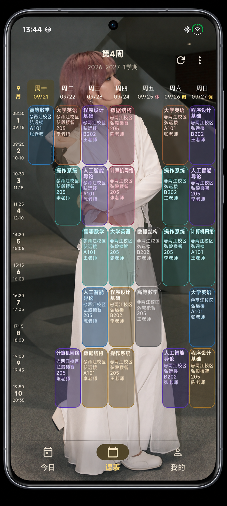
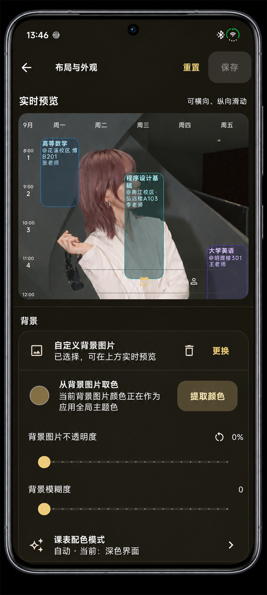
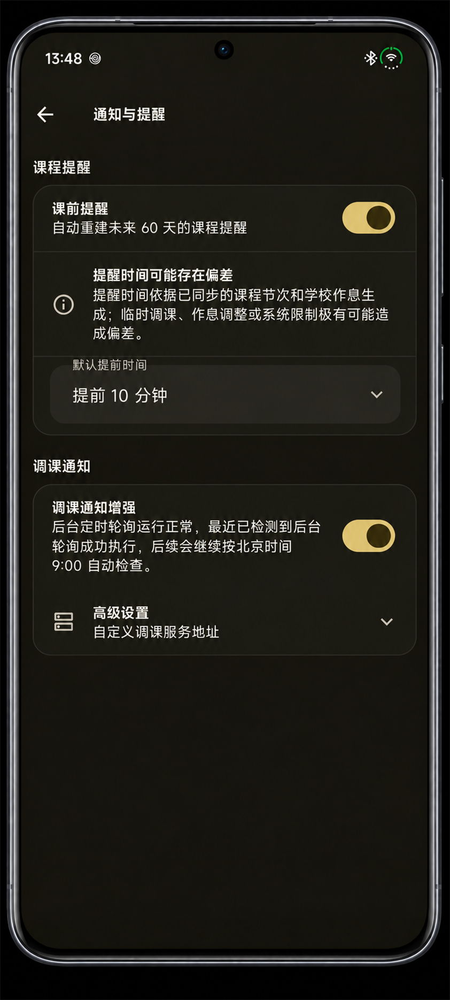

# CQUT Helper

**西唯兵学子的课表小帮手**

面向重庆理工大学同学的第三方 Android 课表助手。

[下载最新版本](https://github.com/lhgr/CQUT-Helper/releases) ·
[核心功能](#-核心功能) ·
[应用截图](#-应用截图) ·
[问题反馈](https://github.com/lhgr/CQUT-Helper/issues)

> [!NOTE]
> CQUT Helper 是第三方非官方应用。重要课程与调课安排请以学校官方信息为准。

## ✨ 核心功能

| 功能 | 说明 |
| --- | --- |
| **今日与周课表** | 查看当天课程和完整周课表，支持周次切换、周末显示和离线缓存 |
| **假期与调休校历** | 根据学校通知的放假与调休日期将调休当天映射到对应课表安排 |
| **桌面小组件** | 提供今日课程、日视图、近日课程、超小课程和垂直列表等样式 |
| **课前提醒** | 根据本机课表安排课程通知，可设置默认提前时间 |
| **调课通知增强** | 可选查询当前学期调课信息，记录新增、变更和撤销，并刷新受影响教学周 |
| **课程个性化** | 支持课程别名、备注、颜色、隐藏状态，以及课程卡片和课表布局调整 |
| **主题与背景** | 支持亮色、深色、Material 3 动态取色、自选主题色和课表背景 |
| **备份与恢复** | 导出或恢复课表布局、主题、提醒和课程个性化设置，不包含登录凭据 |

课表同步后会缓存在本机，临时断网时仍可查看已有课程。放假与调休规则也会应用到
今日页、周课表、课程提醒和桌面小组件，减少特殊教学安排带来的日期混淆。

调课通知增强为可选功能，不开启也不影响登录、普通课表同步、课前提醒和桌面小组件。
详细行为和设置方法见 [调课通知增强功能说明](FastAPI/README.md)。

## 📱 应用截图

<table align="center">
  <tr>
    <td align="center"></td>
    <td align="center"></td>
    <td align="center"></td>
  </tr>
  <tr>
    <td align="center">周课表与假期调休</td>
    <td align="center">布局、背景与课程卡片</td>
    <td align="center">课前提醒与调课通知</td>
  </tr>
</table>

## 📦 下载安装

前往 [GitHub Releases](https://github.com/lhgr/CQUT-Helper/releases) 下载 APK：

| 安装包 | 适用设备 |
| --- | --- |
| **Arm64-v8a** | 绝大多数现代 64 位 Android 手机，建议优先选择 |
| **Armeabi-v7a** | 较旧的 32 位 Android 手机 |
| **x86_64** | 少数模拟器或 x86_64 Android 设备 |
| **Universal** | 不确定设备架构时使用，兼容范围更广但文件更大 |

> [!CAUTION]
> **旧版本升级**
>
> 从 v1.0.0 开始，应用启用了新的长期正式签名，无法从 v0.3.0 及更早版本直接覆盖安装。
> 请先确认账号密码可用，再卸载旧版本并安装新版。卸载会清除旧版本保存在本机的登录状态、课表缓存和设置。

## 🚀 首次使用

1. 使用学校账号登录，进入课表并完成首次同步。
2. 按需调整周末显示、课程卡片、主题和课表背景。
3. 如需课前提醒，在“设置 → 通知与提醒”中开启相关权限。
4. 添加桌面小组件后，如果显示“课表尚未同步”，请回到应用同步一次课表。
5. 如需后台获取调课变化，可在通知设置或课表设置中主动开启“调课通知增强”。

## 🔒 隐私与网络请求

CQUT Helper 不接入 Firebase，也不包含遥测或用户行为统计服务。应用会按功能需要
发起以下网络请求：

| 场景 | 请求内容与用途 |
| --- | --- |
| **学校登录与课表** | 登录时向学校统一认证系统提交登录所需信息，并向学校课表服务请求账号和课表数据 |
| **公开内容** | 请求应用公告、今日一言、假期与调休校历配置，以及 GitHub 版本信息；这些请求不需要发送学校账号凭据或个人课表 |
| **调课通知增强** | 仅在主动开启并确认隐私提示后，向所选调课服务发送学号、教务系统加密密码和当前学期，用于代为查询调课通知 |

- 登录凭据通过系统安全存储保存在设备上；课表缓存、个性化设置和消息记录保存在本机。
- 关闭调课通知增强后，应用不会继续访问官方或自定义调课服务；退出登录也会关闭该功能并清除授权状态。
- 配置自定义调课服务后，请求不会在失败时静默回退到官方服务。
- 加密密码不是明文密码，但仍可用于访问教务系统，请只选择自己信任的调课服务。
- 备份文件不包含登录密码、可用于登录的凭据、诊断日志、课表缓存或自定义背景图片。

## ❓ 常见问题

### 小组件没有及时刷新

先打开应用确认登录状态并手动同步课表，再点击小组件刷新。如果仍无改善，请在
“设置 → 同步与诊断”中检查后台状态，并根据手机系统设置允许应用自启动、后台运行
和忽略电池优化。

### 小组件显示“课表可能已过期”

这表示本机缓存较长时间没有得到成功同步确认。检查网络和登录状态后主动刷新即可。
如果最近已经成功同步，但当前不属于教学周，小组件会显示“当前不在教学周”。

### 放假或调休日期与学校安排不一致

先进入课表设置刷新假期与调休信息，再主动同步相关教学周。校历配置用于辅助展示，
如仍有差异，请以学校最新通知和教务系统课表为准，并通过 Issue 反馈。

### 收不到课前提醒或调课通知

检查通知权限、后台运行限制和电池优化设置。调课通知还需要主动开启“调课通知增强”，
并确保所选服务通过“检查服务可用性”。

### 备份会保存密码吗？

不会。备份只包含设置与课程个性化数据，不包含登录密码、可登录凭据、日志或课表缓存。

## 🧩 项目说明

这是一个个人学习项目，在 AI 协助下持续完善。欢迎通过
[GitHub Issues](https://github.com/lhgr/CQUT-Helper/issues) 提交问题或建议，也可以发送
邮件至 <dawndrizzle0104@gmail.com>。

有关课表数据接口的分析可参阅
[课表 API 相关文章](https://blog.dawndrizzle.top/blog/reverse-timetable)。

## 📚 参考与协议

- [cqut-net-login](https://github.com/CQUT-handsomeboy/cqut-net-login)：密码加密模块参考。
- [Wake Up 课程表](https://www.wakeup.fun/) 与
  [拾光课程表](https://github.com/XingHeYuZhuan/shiguangschedule)：桌面小组件样式参考。
- [CQUT-Course-Guide-Sharing-Scheme](https://github.com/Royfor12/CQUT-Course-Guide-Sharing-Scheme)：
  感谢参与资料整理和分享的同学。

本项目采用 [Apache License 2.0](LICENSE) 开源。

## 👀 访问统计

  

